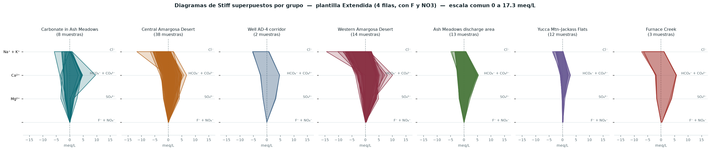

# HydroChem

Herramienta de análisis hidroquímico de aguas subterráneas. Convierte a meq/L, calcula el balance iónico, la alcalinidad y la clasificación de facies, y dibuja el diagrama de Piper, los Stiff, el Durov y el mapa de los puntos de muestreo. Exporta a Google Earth, QGIS y Excel.

Sustituye al notebook de Colab `hydrochemistry_lab.ipynb`, corrigiendo los defectos detectados en la [auditoría](docs/AUDITORIA-FASE-0.md).

---

## Cómo abrirla

**Doble clic en `Abrir HydroChem.bat`.**

Se abre sola en el navegador. Para cerrarla, cierra la ventana negra que aparece.

Corre en tu ordenador: no hay servidor que pagar, ni cuenta, ni suscripción. La única parte que usa internet es el fondo del mapa; sin red, los puntos se siguen viendo sobre fondo liso.

Si el doble clic no funciona, desde una terminal:

```bash
python app/main.py
```

## Qué necesita

Python 3.10 o superior con `pandas`, `numpy`, `openpyxl`, `matplotlib`, `fastapi` y `uvicorn`. **Nada más.** Plotly y Leaflet vienen incluidos en `app/vendor/`, la conversión UTM y la generación de KML/KMZ están implementadas en el propio proyecto, y los tests corren con un runner sin dependencias.

## Las pantallas

| | Qué hace |
|---|---|
| **Datos** | Tabla de muestras con facies y química. Botón *Columnas…* para corregir a mano el mapeo si la detección automática falla |
| **Validar** | Qué se leyó, qué falta, qué valores son sospechosos y por qué |
| **Piper** | Diagrama interactivo con **las dos convenciones**, color por facies/grupo/balance/TDS/cumplimiento, y trayectorias temporales |
| **Stiff** | Un panel por grupo con escala común, o uno por muestra |
| **Durov** | Cuadrado central con los dos ternarios marginales y los paneles de pH y TDS |
| **Normas** | Excedencias frente a la OMS o a una norma propia, con el detalle de qué muestras y cuántas veces el límite |
| **Mapa** | Puntos sobre OpenStreetMap, con selector de sistema de coordenadas |
| **Cruzado** | Mapa, Piper y tabla sincronizados: eliges en uno y se resalta en todos |
| **Tiempo** | Evolución de cada vértice del Piper, de las filas del Stiff y de los parámetros, campaña a campaña |
| **Exportar** | Excel, CSV, KMZ, KML y GeoJSON |

## Qué se corrigió respecto al notebook

| | Notebook | HydroChem |
|---|---|---|
| Filas leídas del libro de ejemplo | 89 de 90 (una se perdía sin aviso) | **90 de 90** |
| Rombo del Piper | Mal dimensionado, invadía los triángulos | **Geometría correcta**, validada contra el libro Excel de referencia |
| Convención del Piper | Una sola, no estándar | **Dos, seleccionables** |
| Durov | Marginales sin contorno, eje Y mal rotulado, panel de pH vacío sin explicación | **Rehecho**, con la proyección documentada y los paneles que se declaran ausentes |
| Clasificación de facies | No existía | **Dos esquemas**: ion dominante y zonas del rombo |
| Análisis de flúor | Limitado a ese ion, con el límite escrito en el código | **Cualquier parámetro contra cualquier norma**, editable |
| Coordenadas UTM | Zona escrita a mano en el código; mapa y KMZ discrepaban | **Selector de sistema**, una sola pareja de columnas WGS84 para todo |
| KMZ | Dependía de `simplekml`; leyenda con puntos en (0,0) | **Sin dependencias**, leyenda como *ScreenOverlay* |
| Columnas sin ninguna medida | Se rellenaban con ceros y entraban en el balance | **Se excluyen y se explica** |
| `<0,05`, `ND` | Se perdían como «sin dato» | **Se leen como censurados**, con su límite de detección |
| Nombres de columna | 17 exactos y obligatorios | **Mapeo automático y corregible desde la pantalla** |
| Valores estimados | Sin distinguir de los medidos | **Marcados en cursiva** en tablas, fichas y KMZ |
| Exportación | KMZ y un XLSX de 30 columnas | KMZ, KML, GeoJSON, CSV y **XLSX con una hoja por bloque** |

## Estructura

```
core/hydrochem/     Motor científico. Sin dependencias de interfaz.
  constants.py        Pesos equivalentes (IUPAC 2021 y PiperStiff), catálogo de iones
  chemistry/          meq/L, balance de carga, alcalinidad, facies
  geometry/           Ternarios, Piper (dos convenciones), Stiff, Durov
  imputation/         Estrategias de estimación, con trazabilidad
  io/                 Lectura de Excel/CSV, mapeo de columnas, límites de detección
  quality/            Umbrales normativos y excedencias
  geo/                Conversión UTM↔WGS84 y exportadores (KML, KMZ, GeoJSON, XLSX)
  validation/         Reglas e informe estructurado
  temporal.py         Series por campaña, sin inventar fechas
  pipeline.py         Encadena todo de principio a fin

app/                Aplicación local (FastAPI + navegador)
tests/              294 pruebas, incluidas las de regresión contra el libro Excel
tools/              Utilidades de desarrollo y generadores de figuras
docs/               Auditoría técnica y figuras
```

## Pruebas

```bash
python tests/run_tests.py
```

Con `pytest` instalado, `pytest tests/` hace lo mismo.

Las pruebas clave no se fían de valores recordados; se apoyan en testigos externos o en propiedades exactas:

- los **meq/L** coinciden **bit a bit** con las columnas R–Z del libro `PiperStiff-QW-2019.v9.xlsm` de Keith Halford (USGS);
- el **balance de carga** coincide con su columna Q;
- los **vértices del rombo del Piper** coinciden con los de su hoja `CONTROL`;
- las **cuatro aguas puras** caen exactamente en los cuatro vértices del rombo, y los **seis extremos del Durov** en sus límites exactos;
- la serie del **arco de meridiano** de la proyección UTM se contrasta contra su integral numérica, y la ida y vuelta cierra con un error máximo de **0,25 mm**;
- el **KMZ** se abre como ZIP, su KML es XML válido y no contiene ningún punto en (0,0);
- las aguas de Amargosa salen **bicarbonatadas** (88 de 90), que es lo que corresponde a ese sistema de flujo.

## Sistemas de coordenadas

La conversión UTM↔WGS84 está implementada en `core/hydrochem/geo/crs.py` con las series de Snyder (1987) sobre el elipsoide WGS84, **sin usar `pyproj`**: en el equipo de destino la instalación de paquetes falla por verificación de certificado, y sin reproyección los datos en UTM —como vienen casi todos los levantamientos en Perú— no se podrían situar en el mapa.

Están las 60 zonas de cada hemisferio, con 18S, 19S y 17S al principio de la lista. En la pantalla **Mapa** eliges el sistema; si no lo declaras, la aplicación propone uno por el rango de los valores y **lo dice en el informe de validación**, porque una zona equivocada coloca los puntos a cientos de kilómetros.

## Sobre los ceros del flúor

32 de las 90 muestras del libro de ejemplo traen `F = 0,00` exacto. **La aplicación los trata como «no medido»**, no como ausencia real en el agua. Tres razones:

- Los ceros se concentran por grupo (100 % en *Well AD-4 corridor*, 0 % en *Ash Meadows discharge area*). La química no conoce esas fronteras; las campañas de muestreo sí.
- 23 de los 32 ceros están en filas cuyo calcio tiene 4 o más decimales, señal de que se reconstruyeron a partir de meq/L. Una reconstrucción no recupera un parámetro que no se midió.
- El valor más bajo realmente medido es 0,20 mg/L. No hay nada entre 0,01 y 0,19.

Cambia el resultado: las excedencias del límite de la OMS pasan de «32 de 90» (36 %) a «32 de 58 medidas» (55 %). El ajuste se ve en la pantalla de validación y se desactiva con un clic.

## Sobre los umbrales normativos

Los valores de la **OMS** están tomados de las *Guidelines for Drinking-water Quality* (4.ª ed., 2011, con el apéndice de 2017) y van marcados como cotejados.

El conjunto **`peru_drinking_template`** es una **plantilla de partida, no una fuente normativa**. Antes de usarlo en un informe hay que cotejarlo con el texto oficial (D.S. 031-2010-SA y D.S. 004-2017-MINAM). La aplicación lo marca como no verificado y lo advierte en el informe de validación cada vez que se selecciona.

Cada umbral lleva su naturaleza: **sanitario** protege la salud, **organoléptico** solo afecta al sabor. Contarlos juntos en un mismo recuento de incumplimientos no dice nada útil, así que se separan.

## Sobre las fechas

Los datos de referencia **no tienen fecha de muestreo** — se verificó celda a celda. La aplicación los trata como una única campaña y lo dice en la barra de estado.

El modelo de datos contempla `Sampled_Date` y `Campaign` como columnas opcionales: el día que cargues datos de varias campañas, se reconocerán solas. **No se inventan fechas ni se interpolan.** Con menos de 3 campañas la aplicación muestra la evolución pero se niega a hablar de «tendencia».

Para ver funcionando el módulo temporal hay un archivo de demostración (botón *Demo con campañas*): 8 campañas, 12 estaciones. Es **sintético** —una deriva inventada aplicada a estaciones reales— y la aplicación lo advierte con un aviso permanente mientras esté cargado. Se regenera con:

```bash
python tools/make_demo_campaigns.py
```

## Publicarla en internet

Se puede, y gratis. Instrucciones paso a paso en
**[`deploy/Render.md`](deploy/Render.md)** — plan gratuito real, sin tarjeta de
crédito, con el proyecto tal cual.

> Hugging Face Spaces **ya no sirve gratis**: desde 2026 el SDK Docker requiere
> plan PRO (9 $/mes) y el nivel gratuito solo admite Spaces estáticos, que no
> ejecutan Python. Las instrucciones siguen en
> [`deploy/HuggingFace-Spaces.md`](deploy/HuggingFace-Spaces.md) por si tienes PRO.

Lo que hizo falta para que fuera publicable:

- **Estado por sesión.** Antes había un único diccionario en el proceso: en local
  no se nota, pero publicada **el segundo visitante sobrescribía los datos del
  primero**. Ahora cada visitante tiene su cookie y ve solo lo suyo
  (`app/session.py`).
- **Control de la subida.** Tamaño máximo, extensiones permitidas, comprobación
  de que el contenido corresponde a la extensión (un `.xlsx` es un ZIP y empieza
  por `PK`), y saneado del nombre para que `../../etc/passwd` no salga de su
  carpeta.
- **Caducidad y cupo.** Una sesión sin actividad se olvida y sus archivos se
  borran; por encima del máximo se descarta la más antigua, para que la memoria
  no crezca sin tope.
- **`Dockerfile`** y **`render.yaml`**, que valen para Render, Koyeb, Fly.io y Cloud Run.
- **`/api/health`** para que el alojamiento sepa si está viva.

Ajustable con variables de entorno: `HC_MAX_UPLOAD_MB` (25), `HC_MAX_SESSIONS`
(40), `HC_SESSION_TTL_MIN` (90).

**No hay cuentas ni contraseñas.** Cada visitante ve solo sus datos, pero
cualquiera con el enlace puede entrar. Si tus datos son sensibles, publica el
Space como *Private*.

**Netlify, GitHub Pages y Vercel no sirven** para la aplicación: solo sirven
archivos estáticos y no pueden ejecutar Python. Sí servirían para un informe
HTML autónomo, que es otra cosa y bastante menos trabajo.

## Archivos de ejemplo

| Archivo | Para qué |
|---|---|
| `tests/fixtures/PiperStiff-QW-2019.v9.xlsm` | El libro original de Halford. Botón *Cargar ejemplo* |
| `data/samples/EJEMPLO-PRUEBA-LimaSur.xlsx` | **Excel de prueba**: cabeceras en castellano, UTM 18S, 3 campañas, valores censurados. Ábrelo con *Abrir archivo* |
| `data/samples/DEMO-SINTETICO-campanas.csv` | 8 campañas para el módulo temporal. Botón *Demo con campañas* |

Los dos últimos son **datos inventados** y la aplicación lo advierte. Se regeneran con:

```bash
python tools/make_test_workbook.py     # el Excel de prueba
python tools/make_demo_campaigns.py    # la demo temporal
```

## Figuras de referencia

```bash
python tools/render_reference.py        # Piper, las dos convenciones
python tools/render_stiff_groups.py     # Stiff superpuestos por grupo
```



## Todavía no está

- Informe en PDF
- Guardado y versionado de proyectos (al cerrar la sesión se pierde lo cargado)
- Cuentas de usuario, si alguna vez hicieran falta
- Tendencias estadísticas (Mann-Kendall, pendiente de Sen) — necesitan 8–10 campañas
- Índices de saturación (PHREEQC), PCA y clustering
- Interpolación espacial e isolíneas
- Índices para riego (SAR, Wilcox, RSC)
